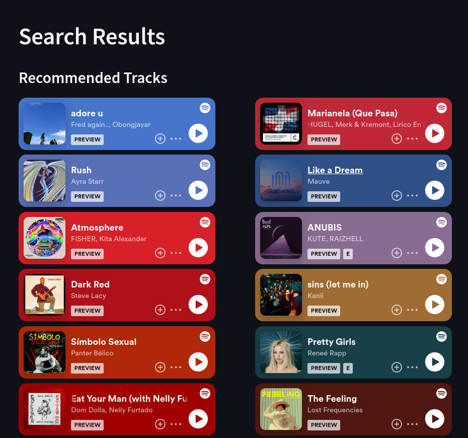

# Welcome to MIAS Documentation

**MIAS** is the **M**usically **I**lliterate **A**id **S**ystem, designed to 
aid artists add to their performance playlist by finding similar songs. 

The following links provide access to the hosted MIAS service and source code: 
- **MIAS:** https://mias-recommender-sys.streamlit.app/
- **Source Code:** https://github.com/trav-d13/MIAS

**This project encourages collaboration!** \
_Whether you are new to recommender systems or a pro.
The project embraced a modular design so that you can test out your own data pipelines and similarity metrics
in a way where you can easily see and deploy your results_

## MIAS Documentation
This section provides access to the extensive documentation underlying the MIAS project.

- [Data Processing](data_processing.md)
- [Similarity Interface](similarity_interface.md)
- [Pipeline interface](pipeline_interface.md)